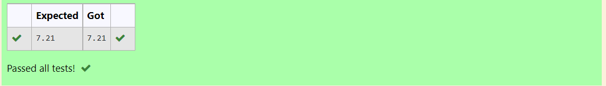

# DISTANCE-BETWEEN-TWO-POINTS

## AIM:
To write a python program to find the distance two 2 points
## ALGORITHM:
### Step 1: 
import math
### Step 2: 
Give the coordinates of both point
### Step 3: 
Substitute the values in the distance formula  
### Step 4:
Run the program
### PROGRAM:

#Program to find the distance between two points.
#Developed by: 
#RegisterNumber:

import math 
  
l2=[10,6]  
l1=[4,2]

d=math.sqrt(((l2[0]-l1[0])**2)+((l2[1]-l1[1])**2))
print("{:.2f}".format(d))  

### OUTPUT:

### RESULT:
The distance between the two points is found using the python program.
